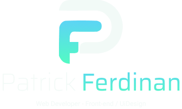

<!--
**patrickferdinan/patrickferdinan** is a ✨ _special_ ✨ repository because its `README.md` (this file) appears on your GitHub profile.

Here are some ideas to get you started:

- 🔭 I’m currently working on ...
- 🌱 I’m currently learning ...
- 👯 I’m looking to collaborate on ...
- 🤔 I’m looking for help with ...
- 💬 Ask me about ...
- 📫 How to reach me: ...
- 😄 Pronouns: ...
- ⚡ Fun fact: ...
-->
## Hi!

 
My name is Patrick Ferdinan, I'm enthusiastic about web development, I'm improving myself on the Reactjs💜 and Nodejs💚 techs.

  

## Experience
  &ensp;&ensp;
  &ensp;&ensp;
  &ensp;&ensp;
  
## Learning
  &ensp;&ensp;
  &ensp;&ensp;
  &ensp;&ensp;
  &ensp;&ensp;
  &ensp;&ensp;
  &ensp;&ensp;
  
## Tools
  &ensp;&ensp;
  &ensp;&ensp;
  &ensp;&ensp;
  &ensp;&ensp;
  &ensp;&ensp;
  &ensp;&ensp;
  
  ## Contacts
 
 

  <a href="https://www.linkedin.com/in/patrick-ferdinan-73136815a/" target="blank">&ensp;&ensp;</a>
  <a href="mailto:patrickferdinan@gmail.com" target="blank">&ensp;&ensp;</a>
  <a href="https://app.rocketseat.com.br/me/patrick-ferdinan-1566796799" target="blank">&ensp;</a>
  

